# Using the P1 manufacturing test firmware

The [certification docs](https://docs.particle.io/guide/how-to-build-a-product/certification/) include a [test firmware file](https://docs.particle.io/assets/files/P0_P1_FCC_Firmware.zip). It allows you to tell the modem to transmit continuously on specific bands and other things you may need to do during certification.

There are two documents within the zip file that describe the operation, but it's a little confusing so here are some additional tips that may help.

You will need:

- A Windows PC
- A ST-LINK/V2 JTAG/SWD Programmer
- A FT232 USB to Serial adapter

You can also use a Windows virtual machine on a Mac, such as in Parallels or VMWare, but because the test code uses a Windows executable, you need to be able to run Windows exe files.

You can use a less expensive SWD USB stick, but then you need to set up openocd. [This page](https://docs.particle.io/faq/particle-tools/jtag/) has instructions for that.

For the USB to TTL serial adapter I use the [Sparkfun FT232RL](https://www.sparkfun.com/products/12731) however you can use other similar products. Note that you need a TTL serial one like this, not one that has a DB9 connector for connecting to real RS232 devices!


Install the [ST-LINK/V2 software for Windows](http://www.st.com/en/development-tools/st-link-v2.html), if you have not already done so. The software is at the bottom of that page.  

The pins on the connector are numbered this way when you have the programmer positioned so the logo is upright and the notch is on the bottom of the 20-pin connector.

|||||||||||
|:-:|:-:|:-:|:-:|:-:|:-:|:-:|:-:|:-:|:-:|
| 2 | 4 | 6 | 8 | 10 | 12 | 14 | 16 | 18 | 20 |
| 1 | 3 | 5 | 7 | 9  | 11 | 13 | 15 | 17 | 19 |
| | | | | notch | | | | | 
 
 
| Pin | Function | Color | P1 Pin |
| --- | --- | --- | --- |
| 1 | VCC | Red | 3V3 |
| 4 | GND | Gray | GND | 
| 7 | SWDIO | Orange | D7 |
| 9 | SWCLK | White | D6 |

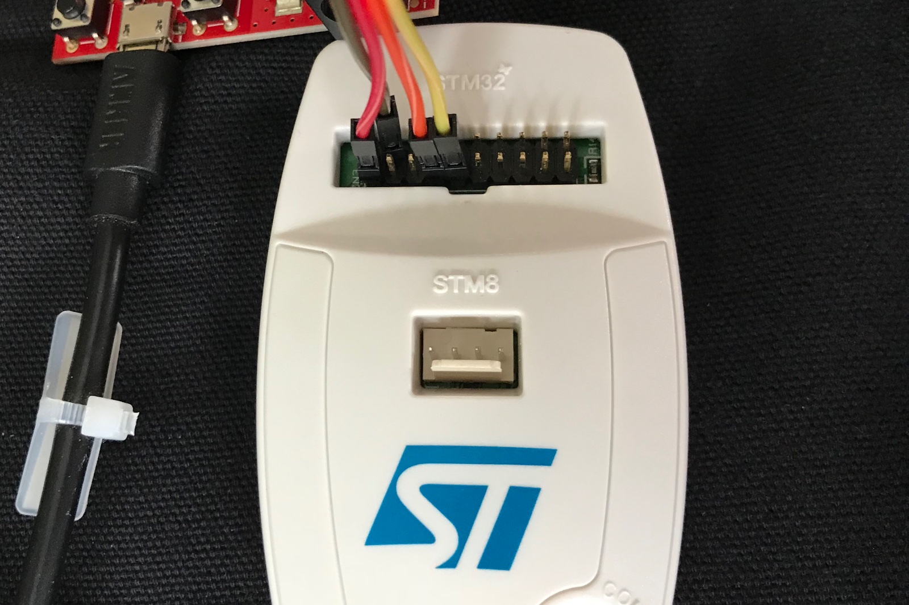

Here it is connected to the Sparkfun Photon Redboard, which is actually a P1, not a Photon.

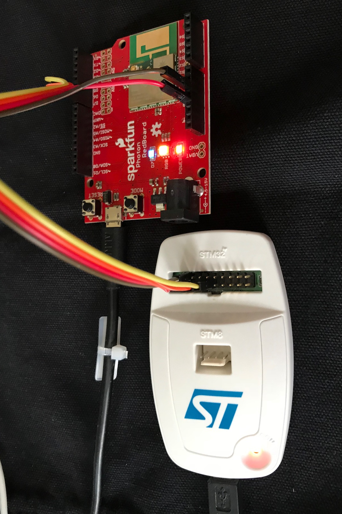


With the ST-LINK, make sure you connect the VCC line to 3V3. It's used to detect the device voltage, and if you don't connect it, it does not work reliably.

In the Settings, you will probably need to select:

- **SWD** (you can use JTAG if you connect the rest of the pins)
- **4.0 MHz** (though slower speeds will work too)
- **Access Port 0**
- **Hot Plug** mode 
- **Software System Reset** reset mode

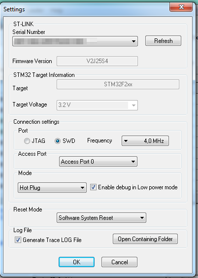

Also, be sure to put the P1 into DFU mode (blinking yellow). In normal operating mode, you likely will not be able to connect by SWD unless you have a SWD-enabled build installed.

## Back up your device

At the very least you'll probably want to back up the DCD so you don't have to reset your device keys. 

With the ST-LINK connected, edit the fields at the top of the memory display pane:

- Address: 0x08004000
- Size: 0x8000
- Data Width: 8 bits

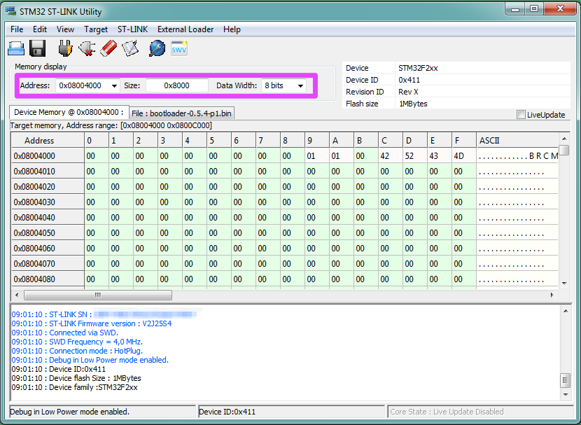

Then use the File - Save File As menu item to save as .bin or a .hex file.

You may want to back up the whole device, which will save time restoring:

- Address: 0x08000000
- Size: 0x100000
- Data Width: 8 bits

You may want to check the settings in **Target** - **Option Bytes...**:

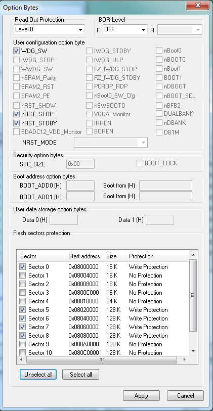

In particular, you may want to turn off **Flash sector protection** on all sectors in the bottom section. Make sure **Read Out Protection** is **Level 0** as well.

## Extract the tool

The binaries, executable, and scripts are included in the **image&tool.7z** file. You'll need an extractor like 7-Zip to extract it.

In the archive you'll find:

- **BM-09\_mfg\_image** - the files for the Photon
- **BM-14\_mfg\_image** - the files for the P1
- **script&wl** - test tools

In the **BM-14\_mfg\_image** directory you'll find three .bin files. We'll use those next.


Then:

- Select **Target** - **Erase Chip**.
- Select **Target** - **Program & Verify**. 

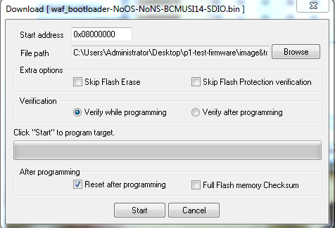

You'll need to repeat the **Program & Verify** three times:

| File | Address |
| --- | --- |
| waf\_bootloader-NoOS-NoNS-BCMUSI14-SDIO.bin | 0x08000000 |
| DCT.bin | 0x08004000 |
| test\_mfg\_test-BCMUSI14.bin | 0x0800C000 |

The firmware should now be programmed. You can disconnect the ST-LINK by using **Target** - **Disconnect** then optionally disconnect the wires as well. You can leave it connected if you want.

If you reset the P1, you'll find it will sit in Dim D7 all the time now. The MODE button won't do anything and the status LED won't turn on anymore. This is normal.

## Connect the Serial Adapter

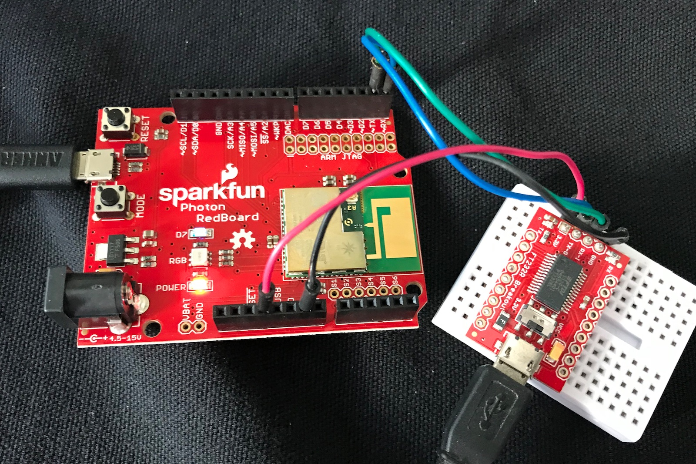

I powered the board from the P1, so I used the 3V3 pin and flipped the switch to 3.3v. Optionally you can leave that disconnected and power it by USB.

Make the following connections:

| P1  | FT232 | Color |
| --- | --- | --- |
| 3V3 | 3.3V | Red |
| GND | GND | Black |
| TX | RX-I | Green | 
| RX | TX-O | Blue |

Note that like many serial applications, TX is connected to RX and vice versa.

Open the Windows **Device Manager** and **Ports (COM & LPT)** and find what COM port the FT232 is mapped to. In this case, it's COM12.

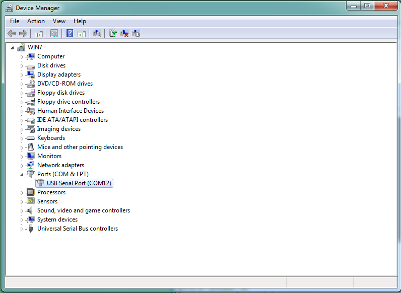

## Edit the scripts

Open a Command Prompt and go into the **scripts** directory.

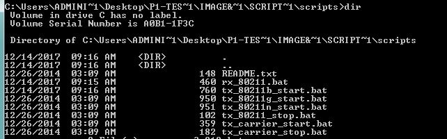

Each of the scripts will need be edited.

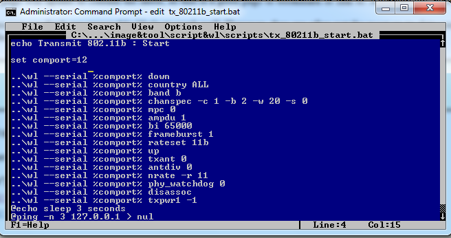

Make sure you set the comport to the correct COM port number (12, in this case).

Also, the some scripts have the wrong path to **wl**. If it's set to **..\src\wl\exe\wl** do a search and replace to **..\wl**.

Then just run the desired script.

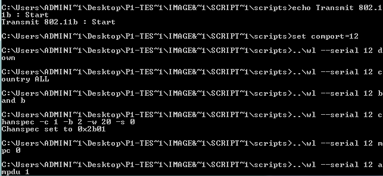

The PDF file at the top of the archive, **USI WM-N-BM-09 wiced module wifi mfg\_tool user guide-English\_docx.pdf** has more information about the scripts and other settings you may want to modify.

## Put everything back

To set your device back to normal, use the **Program & Verify** option to flash the .bin or .hex backup file you saved. 

If you only saved the config, or forgot to save a backup, you should first flash the bootloader. You can download the [bootloader-0.5.4-p1.bin](https://github.com/spark/firmware/releases/tag/v0.5.4) file from Github.

Once the bootloader is flashed, you can then program the system and user parts by USB or [JTAG/SWD](https://docs.particle.io/faq/particle-tools/jtag/). 

If you didn't back up and restore the DCD, you'll need to fix your device keys in DFU mode:

```
particle keys doctor YOUR_DEVICE_ID
```
